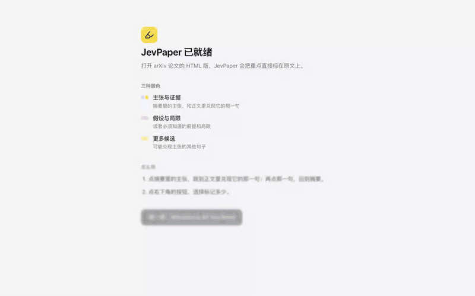
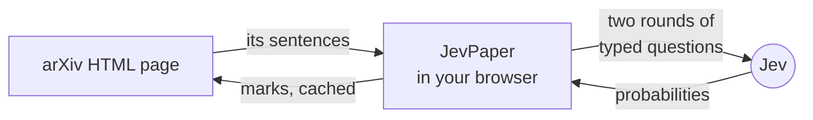

<p align="center">
  <picture>
    <source media="(prefers-color-scheme: dark)" srcset=".github/assets/wordmark-dark.png">
    
  </picture>
</p>

<p align="center">
  <strong>An abstract makes promises. JevPaper shows you where the paper keeps them.</strong><br>
  A Chrome extension that marks every claim in an arXiv abstract, the sentence in the body that delivers it,<br>
  and the assumptions and limits worth knowing, right on the page, in about two seconds.
</p>

<p align="center">
  <a href="https://github.com/SRjoeee/jev-paper/releases"></a>
  <a href="LICENSE"></a>
  
  
  
  
</p>

<p align="center">
  <a href="#install">Install</a> ·
  <a href="#how-it-works">How it works</a> ·
  <a href="#how-good-is-it">How good is it</a> ·
  <a href="#privacy">Privacy</a> ·
  <a href="README.zh-CN.md">简体中文</a>
</p>

<p align="center">
  
</p>

<p align="center"><sub>Real run on <em>Attention Is All You Need</em>: open the paper, the marks appear, click a claim to jump to its evidence, click again to come back, raise the level for caveats and more candidates.</sub></p>

---

## It never writes a word

Most AI reading tools summarise. Summaries paraphrase, and a paraphrase can be wrong in ways you cannot see.

JevPaper does not generate text at all. Every mark is a sentence the authors wrote, highlighted where they wrote
it, so you always read it in its own context. The judging is done by [Jev](https://typesafe.ai), TypeSafe's
System One model. Jev does not write prose; it answers typed questions with probabilities: *which of these
sentences delivers this claim?* *Is this sentence a limitation?* Code decides what to show. There is nothing to
hallucinate, only sentences to rank.

## What you get

<table>
  <tr>
    <td width="50%" valign="top">
      
      <p><strong>Claims, and where they are delivered.</strong> Each claim in the abstract is marked in blue.
      Hover it to see its role (method, result, contribution); click it to jump to the body sentence that
      delivers it, marked in yellow. Click that sentence's tip to jump back.</p>
    </td>
    <td width="50%" valign="top">
      
      <p><strong>Caveats and more candidates.</strong> Raise the level to see the assumptions, conditions and
      limitations a careful reader should know (pink), and the runner-up evidence (pale yellow).</p>
    </td>
  </tr>
  <tr>
    <td width="50%" valign="top">
      
      <p><strong>Three levels, one button.</strong> Claims and evidence; plus assumptions and limitations; plus
      more candidates. The menu is also the legend. Changing the level repaints instantly and asks for nothing
      new.</p>
    </td>
    <td width="50%" valign="top">
      
      <p><strong>At home in dark mode.</strong> The bands follow arXiv's own theme switch, with a palette whose
      contrast against body text is measured, not guessed.</p>
    </td>
  </tr>
</table>

And the details that make it pleasant to read with:

- **Bands, not boxes.** Marks sit behind the text as continuous bands, one per line, with no gaps between lines,
  and step around display equations instead of painting over them.
- **Fast.** About two seconds after the page loads. Each paper is computed once and cached on your machine, so
  reopening it, reloading it or changing the level costs nothing.
- **Keyboard friendly.** Every claim and its evidence are reachable with <kbd>Tab</kbd> and <kbd>Enter</kbd>; the
  menu is a radio group with arrow keys; motion respects *reduce motion*.
- **Yours.** No server, no account, no analytics. You bring the key.

## Install

> [!NOTE]
> JevPaper is a preview. Its interface is in Chinese for now; an English interface is on the roadmap.

1. Download `jev-paper-0.1.0-chrome.zip` from the [latest release](https://github.com/SRjoeee/jev-paper/releases)
   and unzip it into a folder.
2. Open `chrome://extensions`, turn on **Developer mode**, click **Load unpacked** and pick that folder.
3. Pin JevPaper, click its icon, paste an [OpenRouter key](https://openrouter.ai/keys) and press 「开始使用」
   (*Get started*).
4. A short guide opens. Press 「试一试」 (*Try it*) to open *Attention Is All You Need* and watch it get marked.

After that, open any paper's HTML full text, `arxiv.org/html/<id>`, or its ar5iv page. JevPaper does nothing on
abstract pages or PDFs.

<details>
<summary><strong>Other services, and building from source</strong></summary>

**Services.** OpenRouter is the default. You can also use **TypeSafe**, Jev's own API, or **any endpoint** that
speaks Jev's System One protocol, with a model id of your choice. JevPaper checks the key with one small request
before saving it.

**From source.** You need Node.js 22+, [pnpm](https://pnpm.io) 10 and Chrome 128+.

```sh
pnpm i
pnpm build        # then Load unpacked: .output/chrome-mv3
pnpm dev          # Chrome with the extension loaded, reloading as you edit
pnpm zip          # a zip like the one in the release
```

</details>

## How it works



1. **Cut.** The content script cuts the paper into sentences in the page itself, keeping formulas and display
   equations intact, and maps each sentence back to its exact place in the page.
2. **Judge.** The service worker asks Jev two rounds of small, parallel questions. Round one asks what each abstract
   sentence is (a method, a result, a contribution, or background), which body sentence delivers each claim, and
   what kind of caveat each body sentence is, if any. Round two re-ranks each claim's best candidates with a
   question worded for its role, verifies them, and scores the likeliest caveats.
3. **Paint.** Only sentence ids and scores come back. The page paints them as bands behind the text, and the
   result is cached so the paper never costs twice.

A paper takes roughly 20 to 40 requests in two rounds and about a cent through OpenRouter. The question design was
chosen by measurement: in a review of alternatives (one yes/no question per caveat label, graded scores,
pointwise re-ranking, a single round), every other way of asking lost quality. The one saving that held up,
packing the second round into fewer requests, is in.

## How good is it

We hand-labelled 12 papers sentence by sentence, from ResNet, the Transformer, LoRA, DDPM, DPO and the scaling
laws to four 2026 preprints: which abstract sentences are claims, which body sentences deliver each claim, and
which sentences a careful reader must know as caveats. Six papers were used to design JevPaper and six were kept
aside to test it.

| | Design set<br><sub>6 papers, 41 claims</sub> | Held-out test set<br><sub>6 papers, 32 claims</sub> |
|---|:---:|:---:|
| Claims found in the abstract | 96% | 94% |
| The delivering sentence is in the top 3 | 88% | 97% |
| The delivering sentence is ranked first | 77% | 64% |
| Caveat ranking (average precision) | 0.53 | 0.49 |

Measured in September 2026 with `typesafe/jev-1.13-20260917` through OpenRouter: 1 to 3 seconds and
$0.005–0.015 per paper. Every release is checked against this set before it ships.

## Privacy

- **What leaves your computer.** The paper's title and its sentences, as cut from the page you opened, go to the
  service you chose (OpenRouter, TypeSafe or your own endpoint), sent with your key. Nothing goes anywhere else.
  JevPaper has no server of its own and no analytics.
- **What stays on it.** Your key is kept in `chrome.storage.local` on this device and is never synced. The marks
  for each paper are cached in the extension's IndexedDB, up to 500 papers. Papers opened in incognito tabs are not
  cached.
- **Where the key can be read.** The extension's own code reads the key only in its service worker and its popup;
  the script that runs on arXiv pages never reads it, and a test keeps it that way. Chrome itself does not enforce
  this, since it lets any content script of an extension read `chrome.storage.local`. The isolation holds because
  of how the code is written, not because the browser prevents it.

**Permissions:** `storage` for the key, the level and the cache; host access to `openrouter.ai` and
`api.typesafe.ai`, the two preset services (a custom endpoint's origin is requested when you save it); a content
script on arXiv and ar5iv HTML pages, top frame only.

## FAQ

<details>
<summary><strong>Why only the HTML version of arXiv papers?</strong></summary>

Marks have to sit exactly on the sentences a reader is looking at. arXiv's HTML full text is real text with real
structure (sections, equations, footnotes), so every sentence maps back to its place on the page. PDFs are
positioned glyphs, and abstract pages have no body to find evidence in.
</details>

<details>
<summary><strong>Why Jev and not a chat model?</strong></summary>

JevPaper needs judgments, not prose: many small, typed, parallel questions whose answers are probabilities that code
can rank. That is what System One models are built for, and it is why a paper takes seconds and costs about a cent.
</details>

<details>
<summary><strong>What does it cost, and does it charge twice?</strong></summary>

About $0.005–0.015 per paper through OpenRouter, paid with your own key. Each paper is computed once and cached;
reloading, reopening, opening it in a second tab or changing the level makes no new request. If you leave a paper
while it is still being computed, the unfinished work is dropped.
</details>

<details>
<summary><strong>Is the interface available in English?</strong></summary>

Not yet. The interface is in Chinese in this preview. The marks, of course, are on the paper itself.
</details>

## Roadmap

- [ ] English interface
- [ ] Chrome Web Store listing
- [ ] Firefox

## Development

```sh
pnpm test         # unit tests (Vitest + happy-dom)
pnpm e2e          # end-to-end: the built extension in Chromium, saved arXiv pages, a local stand-in for Jev
pnpm typecheck && pnpm lint
```

- `pnpm test` downloads a few arXiv pages the first time it runs. They are fixtures that arXiv may distribute but
  this repository may not; each is checked against a recorded SHA-256 and kept, git-ignored, in `tests/fixtures/`.
- `pnpm e2e` needs Playwright's Chromium (`pnpm exec playwright install chromium`). It uses no key and costs
  nothing; it loads arXiv's own style sheets from the network.
- `pnpm notices` regenerates `public/licenses/THIRD_PARTY.txt` after a dependency changes.

Built with [WXT](https://wxt.dev) and TypeScript: React for the popup and the guide, a framework-free content
script on the page, Dexie for the cache and zod for stored settings.

## Credits

- [Jev](https://typesafe.ai) and its System One protocol are by TypeSafe; [OpenRouter](https://openrouter.ai)
  serves it.
- Sentence extraction, formula handling and band painting build on
  [Read arXiv](https://github.com/SRjoeee/ReadarXiv), a bilingual reader for arXiv HTML by the same author.
- The highlighter icon is from [Lucide](https://lucide.dev).

## Licence

JevPaper is free software under the [GNU General Public License v3](LICENSE). Files adapted from Read arXiv (also
GPL-3.0) name their source in their first line. The Lucide icon is under the ISC licence
([public/licenses/lucide.txt](public/licenses/lucide.txt)); the libraries bundled into the extension keep their
own licences ([public/licenses/THIRD_PARTY.txt](public/licenses/THIRD_PARTY.txt)).
