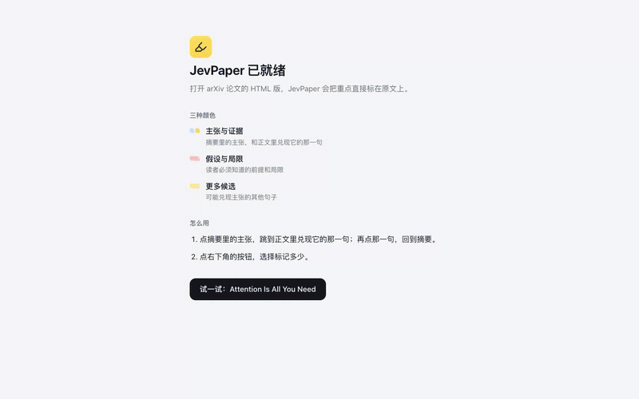
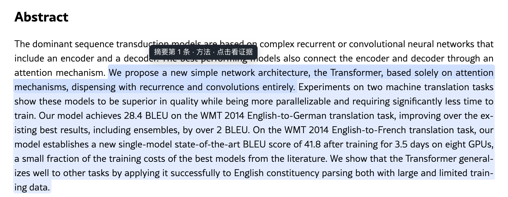
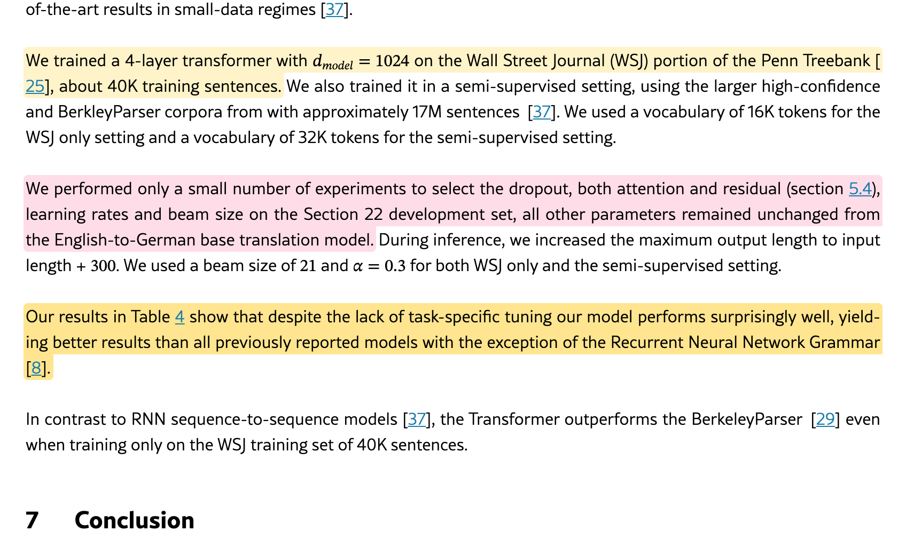
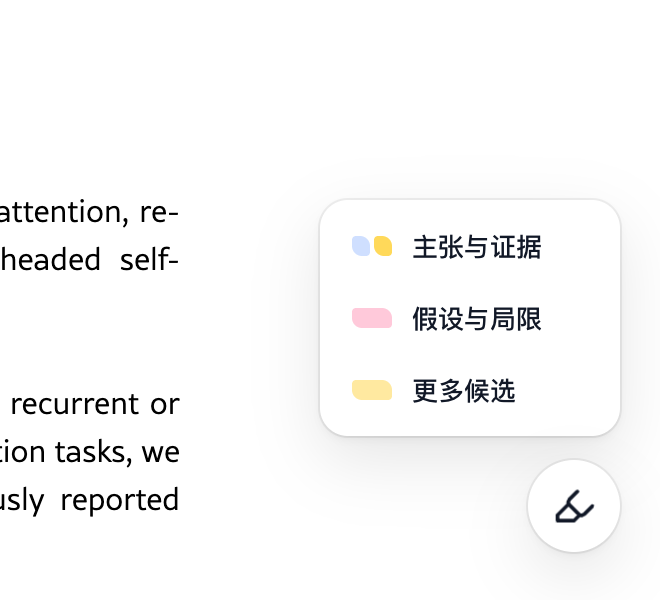
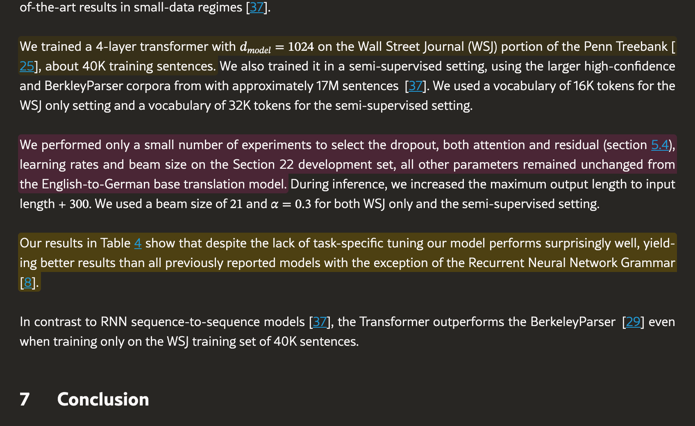
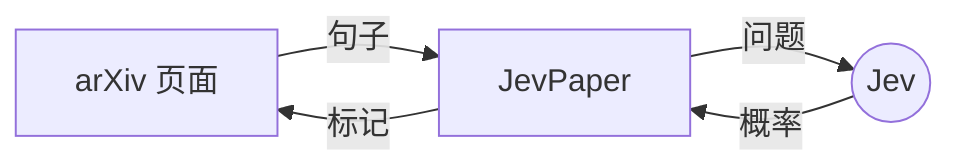

<p align="center">
  <picture>
    <source media="(prefers-color-scheme: dark)" srcset=".github/assets/wordmark-dark.png">
    
  </picture>
</p>

<p align="center">
  <strong>摘要许下的承诺，JevPaper 帮你找到论文在哪里兑现。</strong><br>
  一个 Chrome 插件：打开 arXiv 论文，约两秒后，摘要里的每条主张、正文里兑现它的那一句、<br>
  读者必须知道的前提和局限，都直接标在原文上。
</p>

<p align="center">
  <a href="https://github.com/SRjoeee/jev-paper/releases"></a>
  <a href="LICENSE"></a>
  
  
  
  
</p>

<p align="center">
  <a href="#安装">安装</a> ·
  <a href="#原理">原理</a> ·
  <a href="#效果">效果</a> ·
  <a href="#隐私">隐私</a> ·
  <a href="README.md">English</a>
</p>

<p align="center">
  
</p>

<p align="center"><sub>《Attention Is All You Need》上的真实运行：打开论文，标记出现；点主张跳到证据，再点回到摘要；调高层次看局限和更多候选。</sub></p>

---

## 它一个字也不写

大多数 AI 读论文工具做的是总结。总结就是转述，转述可能错，而你看不出它错在哪。

JevPaper 完全不生成文字。每一处标记都是作者自己写下的句子，标在它原本的位置，你永远是在上下文里读它。判断由 TypeSafe
的 System One 模型 [Jev](https://typesafe.ai) 完成：它不写文章，只回答带类型的问题并给出概率——*这几句里哪一句兑现了这条主张？*
*这一句是不是局限？* 显示什么由代码决定。没有可以编造的内容，只有需要排序的句子。

## 你会得到什么

<table>
  <tr>
    <td width="50%" valign="top">
      
      <p><strong>主张，以及它在哪里兑现。</strong>摘要里的每条主张标成蓝色。悬停看它的角色（方法、结果、贡献）；点击跳到正文里兑现它的那一句（黄色），再点那一句的提示跳回来。</p>
    </td>
    <td width="50%" valign="top">
      
      <p><strong>局限和更多候选。</strong>调高层次，就能看到认真的读者必须知道的假设、适用条件和局限（粉色），以及排在后面的候选证据（浅黄）。</p>
    </td>
  </tr>
  <tr>
    <td width="50%" valign="top">
      
      <p><strong>三个层次，一个按钮。</strong>主张与证据；加上假设与局限；再加更多候选。菜单本身就是图例。切换层次立即重画，不会再请求一次。</p>
    </td>
    <td width="50%" valign="top">
      
      <p><strong>深色模式同样好看。</strong>色带跟随 arXiv 自己的主题切换，深色配色和正文的对比度都经过实测，而不是凭感觉。</p>
    </td>
  </tr>
</table>

还有这些让它读起来舒服的细节：

- **是色带，不是方框**。标记铺在文字后面，每行一条、行与行之间无缝，遇到行间公式会绕开，不会涂满公式。
- **快**。页面加载后约两秒。每篇论文只算一次，结果缓存在你的电脑上；再打开、刷新、切换层次都不花钱。
- **键盘友好**。每条主张和它的证据都能用 <kbd>Tab</kbd>、<kbd>Enter</kbd> 到达；菜单是单选组，可以用方向键；动画遵从「减少动态效果」设置。
- **属于你**。没有服务器、没有账号、没有统计。key 由你自己提供。

## 安装

> [!NOTE]
> JevPaper 目前是预览版。界面跟随你的 Chrome 语言，显示中文或英文。

1. 从 [最新发布](https://github.com/SRjoeee/jev-paper/releases) 下载 `jev-paper-0.2.0-chrome.zip`，解压到一个文件夹。
2. 打开 `chrome://extensions`，打开右上角的「开发者模式」，点「加载已解压的扩展程序」，选中那个文件夹。
3. 把 JevPaper 固定到工具栏，点图标，粘贴一把 [OpenRouter key](https://openrouter.ai/keys)，点「开始使用」。
4. 会打开一页简短的引导。点「试一试」，打开《Attention Is All You Need》，看它被标出来。

之后，打开任意论文的 HTML 全文（`arxiv.org/html/<编号>`）或它的 ar5iv 页面即可。摘要页和 PDF 上 JevPaper 不起作用。

<details>
<summary><strong>其他服务，以及从源码构建</strong></summary>

**服务**。默认用 OpenRouter。也可以用 **TypeSafe**（Jev 的官方 API），或**任何**支持 Jev System One 协议的地址，模型名自填。保存 key 之前，JevPaper 会发一个很小的请求验证它。

**从源码构建**。需要 Node.js 22+、[pnpm](https://pnpm.io) 10、Chrome 128+。

```sh
pnpm i
pnpm build        # 然后「加载已解压的扩展程序」：.output/chrome-mv3
pnpm dev          # 启动带插件的 Chrome，改代码自动重载
pnpm zip          # 打出和发布里一样的 zip
```

</details>

## 原理



1. **切句**。内容脚本在页面里直接把论文切成句子，公式和行间公式保持完整，并把每句映射回它在页面上的确切位置。
2. **判断**。后台分两轮向 Jev 发一批小而并行的问题。第一轮问：摘要每句是什么（方法、结果、贡献还是背景）、正文哪一句兑现了每条主张、每句正文是哪一类局限（如果是）。第二轮用按角色措辞的问题，重排每条主张最好的几个候选并逐一验证，再给最可能的局限打分。
3. **上色**。返回的只有句子编号和分数。页面把它们画成文字后面的色带，结果缓存起来，同一篇论文永远不会花第二次钱。

一篇论文大约两轮共 20–40 个请求，通过 OpenRouter 约 1 美分。问题的设计是实测选出来的：在对其他问法的审查里（每个局限标签单独一个是非题、分级评分、逐条重排、只问一轮），其他问法都会掉质量；唯一站得住的节省——第二轮合并成更少的请求——已经用上了。

## 效果

我们逐句手工标注了 12 篇论文，从 ResNet、Transformer、LoRA、DDPM、DPO、Scaling Laws 到四篇 2026 年的预印本：摘要里哪些句子是主张、正文里哪些句子兑现了每条主张、哪些句子是读者必须知道的局限。其中 6 篇用于设计，另 6 篇留作测试。

| | 设计集<br><sub>6 篇，41 条主张</sub> | 独立测试集<br><sub>6 篇，32 条主张</sub> |
|---|:---:|:---:|
| 找出摘要里的主张 | 96% | 94% |
| 兑现句在前 3 名 | 88% | 97% |
| 兑现句排第 1 | 77% | 64% |
| 局限排序（平均精度） | 0.53 | 0.49 |

2026 年 9 月通过 OpenRouter 用 `typesafe/jev-1.13-20260917` 实测：每篇 1–3 秒、0.005–0.015 美元。每次发布前都会用这组论文复核。

## 隐私

- **什么会离开你的电脑**。论文标题和从你打开的页面切出的句子，会带着你的 key 发给你选的服务（OpenRouter、TypeSafe 或你自己的地址），此外不发给任何地方。JevPaper 没有自己的服务器，也没有统计。
- **什么留在本机**。key 保存在本机的 `chrome.storage.local`，不会同步。每篇论文的标记缓存在插件的 IndexedDB 里，最多 500 篇。无痕窗口里打开的论文不缓存。
- **key 在哪里会被读取**。插件自己的代码只在后台 service worker 和 popup 里读取 key；在 arXiv 页面上运行的脚本从不读取它，并有测试保证这一点。但 Chrome 本身并不强制这种隔离——它允许插件的任何内容脚本读取 `chrome.storage.local`。隔离靠代码的写法成立，而不是浏览器的限制。

**权限：**`storage`，用于 key、层次和缓存；访问 `openrouter.ai` 和 `api.typesafe.ai` 这两个预设服务（自定义地址在保存时单独申请）；在 arXiv 和 ar5iv 的 HTML 页面上运行内容脚本，只在顶层页面。

## 常见问题

<details>
<summary><strong>为什么只支持 arXiv 的 HTML 版？</strong></summary>

标记必须准确落在读者正在看的句子上。arXiv 的 HTML 全文是真正的文字和结构（章节、公式、脚注），每一句都能映射回页面上的位置。PDF 只是摆好位置的字形，摘要页又没有正文可以找证据。
</details>

<details>
<summary><strong>为什么用 Jev，而不是聊天模型？</strong></summary>

JevPaper 需要的是判断，不是文章：大量小的、带类型的、并行的问题，答案是可以由代码排序的概率。这正是 System One 模型擅长的，也是一篇论文只要几秒、约 1 美分的原因。
</details>

<details>
<summary><strong>要花多少钱？会重复扣费吗？</strong></summary>

通过 OpenRouter 每篇约 0.005–0.015 美元，用你自己的 key 付费。每篇论文只算一次并缓存；刷新、再次打开、在第二个标签页打开、切换层次都不会再请求。如果论文还在计算时你就离开了，没算完的部分会被丢弃。
</details>

<details>
<summary><strong>支持哪些语言？</strong></summary>

中文和英文。JevPaper 跟随 Chrome 的语言：中文 Chrome 显示中文，其他语言一律显示英文。当然，标记本身就在论文原文上，论文是什么语言就是什么语言。
</details>

## 路线图

- [x] 英文界面
- [ ] 上架 Chrome 应用商店
- [ ] Firefox

## 开发

```sh
pnpm test         # 单元测试（Vitest + happy-dom）
pnpm e2e          # 端到端：构建好的插件在 Chromium 里跑保存的 arXiv 页面，Jev 用本地替身
pnpm typecheck && pnpm lint
```

- `pnpm test` 第一次运行时会下载几篇 arXiv 页面。它们是 arXiv 允许分发、但本仓库不能收录的测试夹具；每篇都按记录的 SHA-256 校验，存放在 `tests/fixtures/`，不进 git。
- `pnpm e2e` 需要 Playwright 的 Chromium（`pnpm exec playwright install chromium`）。它不用 key、不花钱，会从网络加载 arXiv 自己的样式表。
- 依赖变化后，用 `pnpm notices` 重新生成 `public/licenses/THIRD_PARTY.txt`。

用 [WXT](https://wxt.dev) 和 TypeScript 构建：popup 和引导页用 React，页面上的内容脚本不用框架，缓存用 Dexie，设置用 zod 校验。

## 致谢

- [Jev](https://typesafe.ai) 与它的 System One 协议来自 TypeSafe，由 [OpenRouter](https://openrouter.ai) 提供服务。
- 切句、公式处理和色带绘制建立在同一作者的 [Read arXiv](https://github.com/SRjoeee/ReadarXiv)（arXiv HTML 双语阅读器）之上。
- 荧光笔图标来自 [Lucide](https://lucide.dev)。

## 许可

JevPaper 是自由软件，采用 [GNU 通用公共许可证 v3](LICENSE)。改编自 Read arXiv（同为 GPL-3.0）的文件在第一行注明来源。Lucide 图标采用 ISC 许可（[public/licenses/lucide.txt](public/licenses/lucide.txt)）；打包进插件的第三方库保留各自的许可（[public/licenses/THIRD_PARTY.txt](public/licenses/THIRD_PARTY.txt)）。
